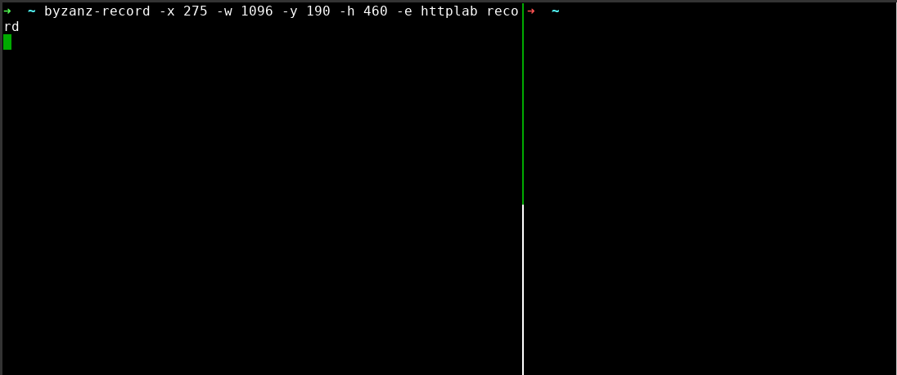

[](https://travis-ci.org/gchaincl/httplab) [](https://goreportcard.com/report/gchaincl/httplab) [](http://makeapullrequest.com)


The interactive web server.

HTTPLabs let you inspect HTTP requests and forge responses.

---


# Install
### Golang
```bash
go get github.com/gchaincl/httplab
go install github.com/gchaincl/httplab/cmd/httplab
```

### Archlinux
```
yaourt httplab
```

### ~Snap~ [FIXME](https://github.com/gchaincl/httplab/issues/78)
On [systems](https://snapcraft.io/docs/core/install) where snap is supported:
```
snap install httplab
```

### Binary distribution
Each release provides pre-built binaries for different architectures, you can download them here: https://github.com/gchaincl/httplab/releases/latest

## Help
```
Usage of httplab:
  -a, --auto-update       Auto-updates response when fields change. (default true)
  -b, --body string       Specifies the inital response body. (default "Hello, World")
  -c, --config string     Specifies custom config path.
      --cors              Enable CORS.
      --cors-display      Display CORS requests. (default true)
  -d, --delay int         Specifies the initial response delay in ms.
  -H, --headers strings   Specifies the initial response headers. (default [X-Server:HTTPLab])
  -p, --port int          Specifies the port where HTTPLab will bind to. (default 10080)
  -s, --status string     Specifies the initial response status. (default "200")
  -v, --version           Prints current version.
```

### Key Bindings
Key                                     | Description
----------------------------------------|---------------------------------------
<kbd>Tab</kbd>                          | Next Input
<kbd>Shift+Tab</kbd>                    | Previous Input
<kbd>Ctrl+a</kbd>                       | Apply Response changes
<kbd>Ctrl+r</kbd>                       | Resets Request history
<kbd>Ctrl+s</kbd>                       | Save Response as
<kbd>Ctrl+f</kbd>                       | Save Request as
<kbd>Ctrl+l</kbd>                       | Toggle Responses list
<kbd>Ctrl+t</kbd>                       | Toggle Response builder
<kbd>Ctrl+o</kbd>                       | Open Body file
<kbd>Ctrl+b</kbd>                       | Switch Body mode
<kbd>Ctrl+h</kbd>                       | Toggle Help
<kbd>Ctrl+w</kbd>                       | Toggle line wrapping
<kbd>q</kbd>                            | Close popup
<kbd>PgUp</kbd>                         | Previous Request
<kbd>PgDown</kbd>                       | Next Request
<kbd>Ctrl+c</kbd>                       | Quit

HTTPLab uses file to store pre-built responses, it will look for a file called `.httplab` on the current directory if not found it will fallback to `$HOME`.
A sample file can be found [here](https://github.com/gchaincl/httplab/blob/master/.httplab.sample).

_HTTPLab is heavily inspired by [wuzz](https://github.com/asciimoo/wuzz)_
